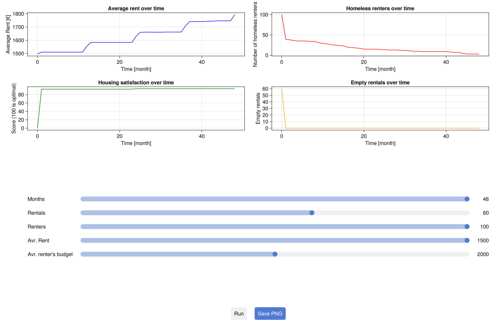
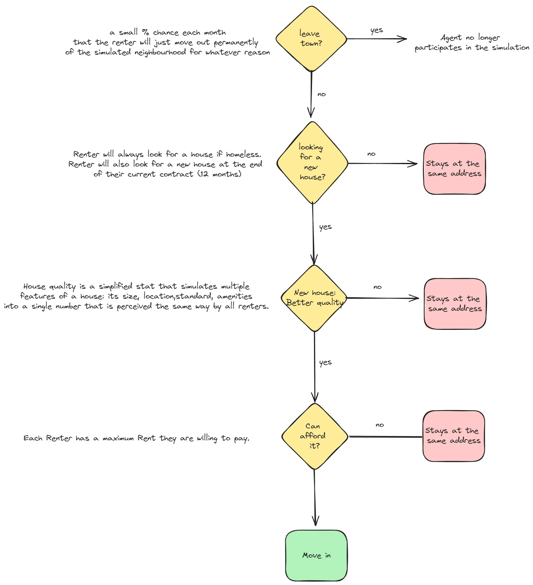

# Toy Model of Rental Market in Julia's Agents.jl



## Table of Contents
- [Introduction](#introduction)
- [Installation](#installation)
- [Usage](#usage)
- [Agent Behavior](#agent-behaviour)
- [Contributions](#contributions)

## Introduction

This project uses [Agents.jl](https://juliadynamics.github.io/Agents.jl/stable/) and is an example of a simple simulation with more than one type of agent (Renters and Rental properties), with each independently perform actions either to maximize their housing satisfaction (inhabiting a desired rental property by a Renter agent) or maximizing rental income (for a Rental agents).

The main goals of this project:
- Showcase for Julia's Agents.jl framework, I want to learn about it and see what I can use it for.
- Provide a first building block for more useful real estate simulations I would like to build in the future.

At this point this simulation does not aspire to be in any way realistic, it is just a technical proof of concept.

## Installation

Install Julia (v1.10 preferably), follow instructions from the [official webpage](https://julialang.org/downloads/), make sure `Julia` is in your `PATH`.
Install the dependancies by running the following in this directory:

```shell
julia       # to enter the REPL
```

Inside Julia's REPL

```julia
]           # enter into Pkg mode
activate    # activate local project
instantiate # install the dependancies
```

Verify by running tests

```shell
julia --project=. sim_test.jl
```

## Usage

You can start the GLMakie based GUI with the provided convenience script

```shell
./start_gui.sh
```

Change the parameters using sliders and press `run`, the first time you press it there will be significant delay before the results are rendered, the subsequent runs will be faster.
Press save PNG tp save the current output, it will be saved as `rental_market_simulation.png` in the current working directory.

## Agent Behaviour

There are two `NoSpaceAgent` types of agents in this simulation:
- Renter, wants to live in the best quality Rental they can afford
- Rental, wants to maximize revenue from being rented out



The Rental's behaviour mostly revolves around the decision to increase/decrease the rent. After 12 months of being occupied it always increases the rent by the max legally allowed (5% by default), using values resembling what is common in the Dutch rental market. If it is vacated it sets its new rent to the market value: an average of rentals of comparable quality. The rent is decreased by 5% every month of being vacant beginning with the second one.

## Contributions

Your feedback and contributions are welcome! If you have suggestions for improvement or wish to contribute to the development of this simulation, please feel free to open an issue or submit a pull request.